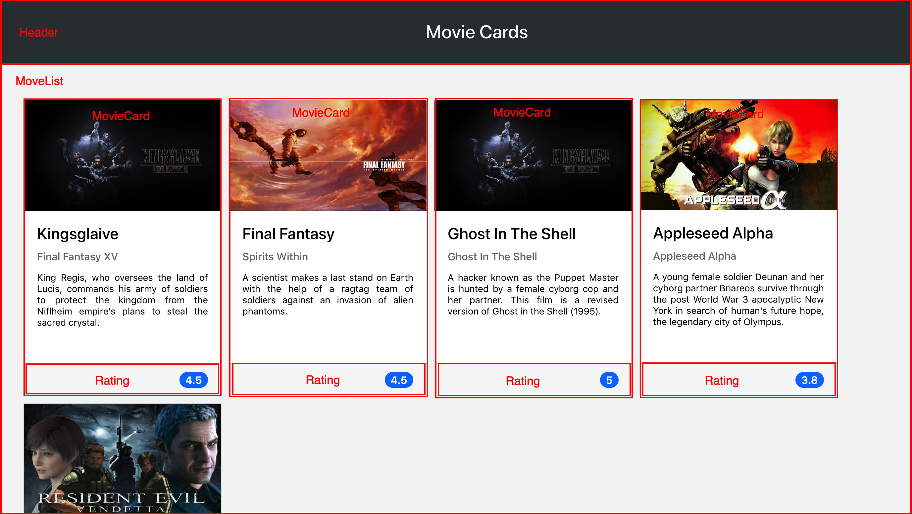
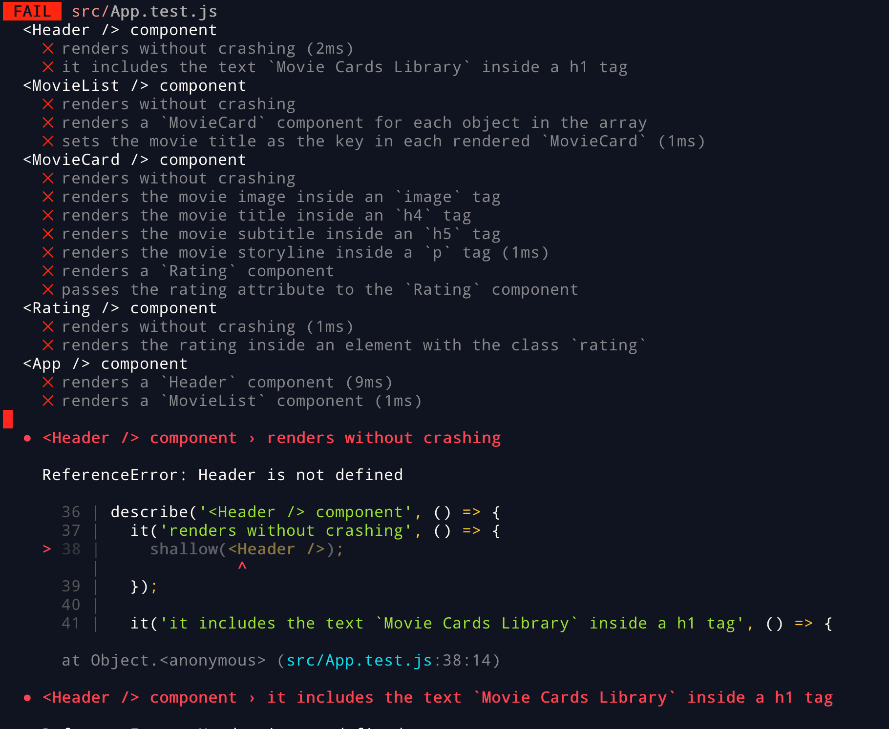

# Boas vindas ao repositório do projeto de Movie Cards Library!

Você já usa o GitHub diariamente para desenvolver os exercícios, certo? Agora, para desenvolver os projetos, você deverá seguir as instruções a seguir. Fique atento a cada passo, e se tiver qualquer dúvida, nos envie por _Slack_! #vqv 🚀

Aqui você vai encontrar os detalhes de como estruturar o desenvolvimento do seu projeto a partir desse repositório, utilizando uma branch específica e um _Pull Request_ para colocar seus códigos.

---

### Entrega

- Projeto individual.

- Será um dia de projeto.

- O projeto tem até a seguinte data: `17/07/2020 - 14:00h`. Para ser entregue a avaliação final.


## O que deverá ser desenvolvido

Você deverá desenvolver uma biblioteca de cartões de filmes utilizando React. A biblioteca deverá possuir um cabeçalho e uma lista de cartões. Cada cartão representa um filme e possui uma imagem, título, subtítulo, sinopse e avaliação. A biblioteca deverá ser algo parecido com a imagem abaixo.


Você precisará implementar um conjunto de componentes em React que irão compor o seu App.

## Desenvolvimento e testes

Este repositório já contem um _template_ com um App React criado e configurado. Após clonar o projeto e instalar as dependências (mais sobre isso abaixo), você não precisará realizar nenhuma configuração adicional. Você deverá completar este _template_ implementando os requisitos listados na próxima seção.

Será necessário criar quatro `React Components`:

   - Header
   - MovieList
   - MovieCard
   - Rating

Cada componente representa uma parte específica do site, conforme ilustrado abaixo:



Todos os componentes devem ser criados dentro da pasta `src/components`. **É importante que seus componentes tenham exatamente os nomes listados acima**.

Todos os requisitos do projeto serão testados automaticamente. Os testes para cada requisitos estão no arquivo `src/App.test.js`. Gaste um tempo lendo-o para entender como os testes estão organizados.

Para executar os testes localmente, digite no terminal o comando `npm test`. Inicialmente, seus testes estarão assim:



A primeira parte da saída mostra um sumário de cada teste e seu status. Um ❌ representa um teste falhando, enquanto um ✅ representa um teste correto. Naturalmente, no início todos os testes estarão falhando.

Abaixo do sumário, para cada teste falhando, há uma mensagem explicativa sobre o motivo que causou a falha do teste, assim como a linha em que a falha ocorreu. Na imagem, vemos que o teste falha porque o componente `Header`, utilizado na linha 38, não está definido.

Se fizermos uma implementação simples do componente `Header`, que não renderiza nada:

```jsx
import React from 'react';

class Header extends React.Component {
  render() {
  }
}

export default Header;
```

E descomentarmos a linha que importa o componente `Header` em `App.test.js`:

```js
// import App from './App';
import Header from './components/Header';
// import MovieCard from './components/MovieCard';
// import MovieList from './components/MovieList';
// import Rating from './components/Rating';
```

Veremos que o primeiro teste agora passa:


Quando seu projeto estiver terminado, todos os testes deverão estar passando:


#### Dica: desativanto testes

Especialmente no início, quando a maioria dos testes está falhando, a saída após executar os testes é bastante poluída. Você pode desabilitar temporariamente um teste utilizando a função `skip` junto à função `it`. Como o nome indica, esta função "pula" um teste:

```js
it.skip('it includes the text `Movie Cards Library` inside a h1 tag', () => {
  wrapper = shallow(<Header />);

  expect(wrapper.find('header h1').text()).toBe('Movie Cards Library');
});
```

Na saída da execução dos testes, você verá um  indicando que o teste está sendo pulado:


Uma estratégia é pular todos os testes no início e ir implementando um teste de cada vez, removendo dele a função `skip`.

⚠️ Lembre-se de não entregar o projeto com nenhum teste ignorado. Testes ignoradados serão tratados como testes falhando.

#### Dica: watch mode

Ao executar os testes localmente, [Jest](https://jestjs.io/), a ferramenta que executa os testes, entra em _watch mode_. Nesse modo, a cada vez que um arquivo é salvo, os testes são executados novamente. Isso pode aumentar sua produtividade removendo a necessidade de executar os testes manualmente o tempo todo. Você pode abrir uma aba no seu terminal ou no terminal do _VSCode_ e deixar o _Jest_ rodando nesse modo.

## Requisitos do projeto

⚠️ Lembre-se que o seu projeto só será avaliado se estiver passando pelos _checks_ do **CodeClimate**

#### 1 Crie um componente chamado `Header`

Esse componente representará o cabeçalho da página.

#### 2 Renderize o texto "Movie Cards Library" dentro de `Header`

O texto deverá estar dentro de uma tag `h1`, que por sua vez deve estar dentro de uma tag `header`.

#### 3 Crie um componente chamado `MovieList`

Este componente representará toda a área com os cartões de filmes. `MovieList` deve receber uma prop `movies`, que é um array de objetos com informações de um filme.

#### 4 Renderize componentes `MovieCard` dentro de `MovieList`

`MovieList` deve renderizar um componente `MovieCard` para cada objeto contido no array recebido na prop `movies`.

#### 5 Passe uma key para cada `MovieCard` renderizado

`MovieList` deve renderizar `MovieCard`s de forma dinâmica. Ou seja, deve utilizar a função `map` para renderizar uma lista. Cada componente `MovieCard` deve receber uma prop `key` com o nome do filme.

#### 6 Crie um componente chamado `MovieCard`

Esse componente representa um cartão de filme. `MovieCard` deve receber uma prop `movie`. Essa prop será um objeto, contendo as propriedades, `title`, `subtitle`, `storyline`, `imagePath` e `rating`.

#### 7 Renderize a imagem do filme

`MovieCard` deve renderizar uma tag `img`, tendo como atributo `src` o valor da propriedade `imagePath` do objeto recebido como prop.

#### 8 Renderize o título do filme

`MovieCard` deve renderizar o título do filme dentro de uma tag `h4`. O título está contido na propriedade `title` do objeto recebido como prop.

#### 9 Renderize o subtítulo do filme

`MovieCard` deve renderizar o subtítulo do filme dentro de uma tag `h5`. O subtítulo está contido na propriedade `subtitle` do objeto recebido como prop.

#### 10 Renderize a sinopse do filme

`MovieCard` deve renderizar a sinopse do filme dentro de uma tag `p`. A sinopse está contida na propriedade `storyline` do objeto recebido como prop.

#### 11 Renderize um componente `Rating` dentro de `MovieCard`

`MovieCard` deve renderizar um componente `Rating`.

#### 12 Passe como prop para o componente `Rating` o atributo `rating`

`MovieCard` deve passar para o componente `Rating` uma prop chamada `rating`. O valor dessa prop é a propriedade `rating` do objeto recebido na prop `movie`.

#### 13 Crie um componente chamado `Rating`

Esse componene representa a avaliação de um filme.

#### 14 Renderize a nota de um filme dentro de `Rating`

`Rating` deve renderizar a nota do filme recebido na prop `rating` dentro de um elemento com a classe `rating`.

#### 15 `App` deve renderizar `Header`

O componente `App` deve renderizar um componente `Header`.

#### 16 `App` deve renderizar `MovieList`

O componente `App` deve renderizar um componente `MovieList`, passando como prop `movies` a lista de filmes contida no arquivo `data.js`. Para isso, você precisará importar `data.js` dentro de `App.js`.

---

## Instruções para entregar seu projeto:

### ANTES DE COMEÇAR A DESENVOLVER:

1. Clone o repositório
  * `git clone git@github.com:tryber/sd-05-block11-project-movie-cards-library.git`.
  * Entre na pasta do repositório que você acabou de clonar:
    * `cd sd-05-block11-project-movie-cards-library`

2. Instale as dependências, inicialize o projeto e rode os testes
  * Instale as dependências:
    * `npm install`
  * Inicialize o projeto:
    * `npm start` (uma nova página deve abrir no seu navegador com um texto simples)
  * Verifique que os testes estão executando:
    * `npm test` (os testes devem rodar e falhar)

3. Crie uma branch a partir da branch `master`
  * Verifique que você está na branch `master`
    * Exemplo: `git branch`
  * Se não estiver, mude para a branch `master`
    * Exemplo: `git checkout master`
  * Agora, crie uma branch onde você vai guardar os `commits` do seu projeto
    * Você deve criar uma branch no seguinte formato: `nome-de-usuario-nome-do-projeto`
    * Exemplo: `git checkout -b joaozinho-movie-cards-library`

4. Crie a pasta `components` dentro da pasta `src` e um arquivo `Header.jsx` dentro dessa pasta:
  * Verifique que você está na raiz do projeto
    * Exemplo: `pwd` -> o retorno vai ser algo tipo _/Users/joaozinho/code/**sd-05-block11-project-movie-cards-library**_
  * Crie a pasta `components` e o arquivo `Header.jsx`
    * Exemplo:
      * `mkdir src/components`
      * `touch src/components/Header.jsx`
      * `echo "// Iniciando o projeto 🚀" > src/components/Header.jsx`

5. Adicione as mudanças ao _stage_ do Git e faça um `commit`
  * Verifique que as mudanças ainda não estão no _stage_
    * Exemplo: `git status` (deve aparecer listada a pasta _components_ em vermelho)
  * Adicione o novo arquivo ao _stage_ do Git
      * Exemplo:
        * `git add .` (adicionando todas as mudanças - _que estavam em vermelho_ - ao stage do Git)
        * `git status` (deve aparecer listado o arquivo _components/Header.jsx_ em verde)
  * Faça o `commit` inicial
      * Exemplo:
        * `git commit -m 'iniciando o projeto. VAMOS COM TUDO :rocket:'` (fazendo o primeiro commit)
        * `git status` (deve aparecer uma mensagem tipo _nothing to commit_ )

6. Adicione a sua branch com o novo `commit` ao repositório remoto
  * Usando o exemplo anterior: `git push -u origin joaozinho-movie-cards-library`

7. Crie um novo `Pull Request` _(PR)_
  * Vá até a página de _Pull Requests_ do [repositório no GitHub](https://github.com/tryber/sd-05-block11-project-movie-cards-library/pulls)
  * Clique no botão verde _"New pull request"_
  * Clique na caixa de seleção _"Compare"_ e escolha a sua branch **com atenção**
  * Clique no botão verde _"Create pull request"_
  * Adicione uma descrição para o _Pull Request_ e clique no botão verde _"Create pull request"_
  * **Não se preocupe em preencher mais nada por enquanto!**
  * Volte até a [página de _Pull Requests_ do repositório](https://github.com/tryber/sd-05-block11-project-movie-cards-library/pulls) e confira que o seu _Pull Request_ está criado

---

### DURANTE O DESENVOLVIMENTO

* ⚠ **PULL REQUESTS COM ISSUES NO CODE CLIMATE NÃO SERÃO AVALIADAS, ATENTE-SE PARA RESOLVÊ-LAS ANTES DE FINALIZAR O DESENVOLVIMENTO!** ⚠

* Faça `commits` das alterações que você fizer no código regularmente

* Lembre-se de sempre após um (ou alguns) `commits` atualizar o repositório remoto

* Os comandos que você utilizará com mais frequência são:
  1. `git status` _(para verificar o que está em vermelho - fora do stage - e o que está em verde - no stage)_
  2. `git add` _(para adicionar arquivos ao stage do Git)_
  3. `git commit` _(para criar um commit com os arquivos que estão no stage do Git)_
  5. `git push -u nome-da-branch` _(para enviar o commit para o repositório remoto na primeira vez que fizer o `push` de uma nova branch)_
  4. `git push` _(para enviar o commit para o repositório remoto após o passo anterior)_

---

### DEPOIS DE TERMINAR O DESENVOLVIMENTO

Para **"entregar"** seu projeto, siga os passos a seguir:

* Vá até a página **DO SEU** _Pull Request_, adicione a label de _"code-review"_ e marque seus colegas
  * No menu à direita, clique no _link_ **"Labels"** e escolha a _label_ **code-review**
  * No menu à direita, clique no _link_ **"Assignees"** e escolha **o seu usuário**
  * No menu à direita, clique no _link_ **"Reviewers"** e digite `students`, selecione o time `tryber/students-sd-05`

Se ainda houver alguma dúvida sobre como entregar seu projeto, [aqui tem um video explicativo](https://vimeo.com/362189205).

⚠ Lembre-se que garantir que todas as _issues_ comentadas pelo CodeClimate estão resolvidas! ⚠

---

### REVISANDO UM PULL REQUEST

⚠⚠⚠

À medida que você e as outras pessoas que estudam na Trybe forem entregando os projetos, vocês receberão um alerta via Slack para também fazer a revisão dos Pull Requests dos seus colegas. Fiquem atentos às mensagens do "Pull Reminders" no Slack!

Use o material que você já viu sobre [Code Review](https://course.betrybe.com/real-life-engineer/code-review/) para te ajudar a revisar os projetos que chegaram para você.
