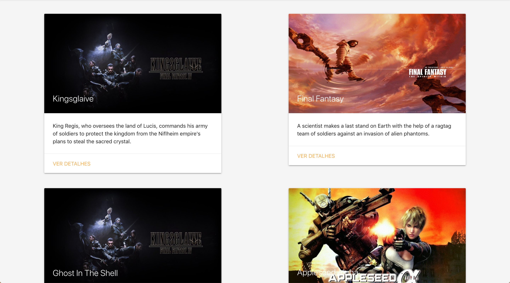
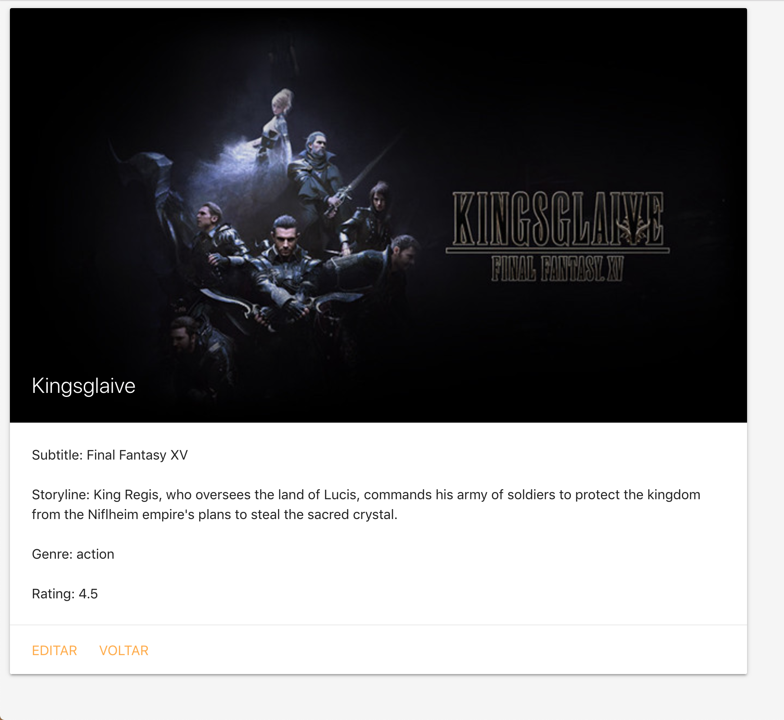

# Boas vindas ao repositório do projeto de Movie Cards CRUD!

Você já usa o GitHub diariamente para desenvolver os exercícios, certo? Agora, para desenvolver os projetos, você deverá seguir as instruções a seguir. Fique atento a cada passo, e se tiver qualquer dúvida, nos envie por _Slack_! #vqv 🚀

Aqui você vai encontrar os detalhes de como estruturar o desenvolvimento do seu projeto a partir deste repositório, utilizando uma branch específica e um _Pull Request_ para colocar seus códigos.

## O que deverá ser desenvolvido

Dando continuidade aos últimos projetos, você criará um [_CRUD_](https://en.wikipedia.org/wiki/Create,_read,_update_and_delete) de cartões de filmes em React. Como todo _CRUD_, em seu app deverá ser possível:

  - Listar todos os filmes cadastrados, com informações resumidas sobre cada filme;
  - Exibir informações detalhadas de um filme selecionado;
  - Adicionar um novo filme à lista;
  - Editar um filme da lista;
  - E apagar um filme da lista.

Nos últimos projetos, por mais que o app tenha sido desenvolvido utilizando múltiplos componentes, o que é uma boa prática, todas as funcionalidades eram acessadas ao mesmo tempo, no mesmo lugar, utilizando apenas uma URL (`localhost:3000`, normalmente). Na mesma página onde havia a listagem de filmes, havia um formulário pra criar um novo filme, por exemplo. À medida que seus apps se tornarem maiores e mais complexos, isso se tornará inviável. Desta vez, as funcionalidades do app serão agrupadas e organizadas em rotas.

Uma rota define o que deve ser renderizado na página ao abri-la. Cada rota está associada a um caminho. O caminho é a parte da URL após o domínio (nome do site, de forma simplificada). Por exemplo, em `www.example.com/foo/bar`, o caminho é `/foo/bar`. Até agora, todos os apps React que você desenvolveu possuiam somente uma rota, a raiz (`/`).

Este app terá 4 rotas:

1. A rota raiz (index), no caminho `/`. Esta rota exibirá uma lista com todos os filmes cadastrados. Essa lista contém informações resumidas sobre cada filme.

2. Uma rota para mostrar informações detalhadas de um filme, no caminho `/movies/:id`. Onde o `:id` é o parâmetro da URL que representa id do filme exibido. Por exemplo, ao entrar no caminho `/movies/5`, serão exibidas informações sobre o filme com id 5.

3. Uma rota para criar novos filmes, no caminho `/movies/new`. Essa rota renderizará um formulário para adicionar um novo filme.

4. Uma rota para editar um filme, no caminho `/movies/:id/edit`. Analogamente à rota 2, `:id` é o id do filme a ser editado. Essa rota renderizará um formulário idêntico ao da rota 3. Nesse caso, porém, o formulário virá preenchido com as informações do filme a ser editado. Ao submeter o formulário, ao invés de criar um novo filme, o filme em questão terá seus dados atualizados.

Relacionado a cada rota haverá um componente React responsável por renderizar seu conteúdo. Esse mapeamento entre o caminho da URL, rota e componente será feito pelo `React Router`, a principal biblioteca de roteamento em `React`.

Naturalmente, haverá links de navegação e redirecionamento entre as diferentes rotas. Por exemplo, na rota 1, haverá, para cada filme, um link para a rota 2, onde se poderá ver informações detalhadas sobre o filme escolhido. Na rota 2, haverá um link para a rota 4, a fim de se editar informações do filme. Ao submeter o formulário, o app automaticamente será levado de volta à rota 2, mostrando as informações atualizadas do filme. Tudo isso será feito utilizando os componentes da biblioteca `React Router`.

Outra diferença importante neste projeto em relação aos anteriores é que os dados virão de uma API (simulada) e não mais de um arquivo estático. Você utilizará essa API para ler, criar, atualizar e apagar filmes. Logo, você terá que lidar com requisições assíncronas e _promises_. Também deverá fazer uso de _lifecycle methods_ e de estados para controlar o que é renderizado por seus componentes a depender de em que momento as requisições se encontram.

## Desenvolvimento

Este repositório já contém um _template_ com um App React criado e configurado. Após clonar o projeto e instalar as dependências (mais sobre isso abaixo), você não precisará realizar nenhuma configuração adicional. Todos os componentes estritamente necessários para finalizar o projeto já estão criados, mas você pode adicionar outros se julgar necessário. Você deverá complementar estes componentes de forma a satisfazer os requisitos listados na próxima seção.

## Requisitos do projeto

**ATENÇÃO!** Muito cuidado com os nomes especificados nos requisitos! O conteudo deve ser exatamente igual ao texto descrito no requisito. Se vocês perceberem, em alguns componentes react do projeto foram colocados os datasets _data-testid_ que, sob qualquer hipótese não devem ser alterados. Os detalhes acima tem implicação direta no funcionamento do avaliador.

Os testes foram desenvolvidos dessa forma para permitir uma maior liberdade para estruturar e estilizar a página, portanto, abusem da criatividade! 😉

### 1 - Rotas: O componente `App` deve renderizar `BrowserRouter`

Você deve utilizar um `BrowserRouter` pra criar as rotas da sua aplicação. As urls de cada página deve ser desenvolvida conforme especificado na seção _O que será desenvolvido_.

### 2 - Movie list: Ao ser montado, `MovieList` deve fazer uma requisição para buscar a lista de filmes a ser renderizada

Para buscar a lista, você deve utilizar a função `getMovies` importada do módulo `movieAPI` em `MovieList`. Essa função retorna uma _promise_. A requisição deve ser feita no momento em que o `MovieList` for montado no DOM. Enquanto a requisição estiver em curso, `MovieList` deve renderizar o componente `Loading`, como ilustrado na imagem a seguir.


Obs: O componente `Loading` deve conter o texto `Carregando...`

Uma vez que a requisição retornar, o resultado deve ser renderizado. Para cada filme, renderize um componente `MovieCard`, como ilustrado abaixo.



Você precisará adicionar um estado em `MovieList` para controlar o que será exibido.

### 3 - `MovieCard`: deve possuir um link para a página de detalhes de um filme

Todos `MovieCard` deve possuir em seu conteudo no mínimo título e sinopse de seu respectivo filme e um link com o texto "VER DETALHES" que aponta para a rota `movies/:id`, onde `:id` é o id do filme. Esta rota exibirá informações detalhadas de um filme.

### 4 - `MovieDetails`: deve fazer uma requisição para buscar o filme que deverá ser renderizado

`MovieDetails` se comporta de forma muito semelhante ao `MovieList`. Ao ser montado, deve fazer uma requisição utilizando a função `getMovie` do módulo `movieAPI`, passando o id do filme. O componente `Loading` deve ser renderizado enquanto a requisição estiver em curso. Após terminar, deve-se renderizar um card com mais detalhes sobre o filme, contendo:

  - Uma `` com a imagem do filme e `alt='Movie Cover'`;
  - Título;
  - Subtítulo;
  - Sinopse;
  - Gênero;
  - Avaliação;
  - um link com o texto "EDITAR" apontando para a rota `/movies/:id/edit` e um link apontando para a rota raiz (`/`) com o texto "VOLTAR".

Os campos devem existir no cartão conforme ilustrado na imagem abaixo.



### Para os requisitos 5 e 6:

Para correta avaliação, os campos do formulário devem possuir as seguintes tags `<label>` e  tipos de entrada:
- label: 'Título', entrada: tag `<input>` de tipo 'text'
- label: 'Subtítulo', entrada: tag `<input>` de tipo 'text'
- label: 'Imagem', entrada: tag `<input>` de tipo 'text'
- label: 'Sinopse', entrada: tag `<textarea>`
- label: 'Gênero', entrada: tag `<select>`, com as seguintes opções:
    - `<option value="action">Ação</option>`
    - `<option value="comedy">Comédia</option>`
    - `<option value="thriller">Suspense</option>`
    - `<option value="fantasy">Fantasia</option>`
- label: 'Avaliação', entrada: tag `<input>`, de tipo 'number' com valores que vão de 0 (mínimo) a 5 (máximo), com um step de 0.1.

Obs: O conteudo das tags `<label>` devem estar idênticos ao específicado acima. Importante associar corretamente todas as suas entradas e labels!


### 5 - `EditMovie`: deve realizar uma requisição para buscar o filme que será editado.

Ao ser montada, a página de edição do filme deve fazer uma requisição pra buscar o filme que será editado e deve, ao ter seu formulário submetido, artualizar o filme e redirecionar a página pra rota raíz.

### 6 - `NewMovie`: Na página inicial, deve haver um link para criar novos cartões.

O link deve conter o texto "ADICIONAR CARTÃO" e apontar para a rota `/movies/new`, contendo um formulário para criar novos cartões.

Na rota `/movies/new`, utilizando a callback passada para `MovieForm`, `NewMovie` deve criar um novo cartão utilizando a função `createMovie` do módulo `movieAPI`. Após o fim da requisição, `NewMovie` deve redirecionar o app para a página inicial, contento o novo cartão.

### 7 - Adicione proptypes a todos os componentes

Todos os compontens que recebem _props_ devem ter suas _proptypes_ corretamente declaradas. O _eslint_ checa automaticamente declaração de _proptypes_, portanto seu _Pull Request_ deverá passar no _Code Climate_ para satisfazer esse requisito.

### Bônus: Adicione um link para deletar um cartão em `MovieDetails`.

Ao clicar neste link, faça uma requisição utilizando a função `deleteMovie` do módulo `movieAPI`. Após finalizar a requisição, redirecione o app para a página inicial. O cartão apagado não deverá mais se encontrar na lista.

---

## Instruções para entregar seu projeto:

### Entrega

  - Projeto individual.

  - Será um dia de projeto.
  
  - O projeto tem até a seguinte data: `29/07/2020 - 14:00h`. Para ser entregue a avaliação final.


### ANTES DE COMEÇAR A DESENVOLVER:

1. Clone o repositório
  * `git clone git@github.com:tryber/sd-05-block13-project-movie-card-library-crud.git`.
  * Entre na pasta do repositório que você acabou de clonar:
    * `cd sd-05-block13-project-movie-card-library-crud`

2. Instale as dependências e inicialize o projeto
  * Instale as dependências:
    * `npm install`
  * Inicialize o projeto:
    * `npm start` (uma nova página deve abrir no seu navegador com um texto simples)

3. Crie uma branch a partir da branch `master`
  * Verifique que você está na branch `master`
    * Exemplo: `git branch`
  * Se não estiver, mude para a branch `master`
    * Exemplo: `git checkout master`
  * Agora, crie uma branch onde você vai guardar os `commits` do seu projeto
    * Você deve criar uma branch no seguinte formato: `nome-de-usuario-nome-do-projeto`
    * Exemplo: `git checkout -b joaozinho-movie-card-library-crud`

4. Faça alterações em algum dos componentes que precisam de implementação, por exemplo o `App` em `src/`:
```jsx
import React from 'react';
import { BrowserRouter as Router } from 'react-router-dom';
import './App.css';

function App() {
  return (
    <Router>
      <div>Movie Card Library CRUD</div>
    </Router>
  );
}

export default App;
```

5. Adicione as mudanças ao _stage_ do Git e faça um `commit`
  * Verifique que as mudanças ainda não estão no _stage_
    * Exemplo: `git status` (deve aparecer listado o arquivo _src/App.js_ em vermelho)
  * Adicione o arquivo alterado ao _stage_ do Git
      * Exemplo:
        * `git add .` (adicionando todas as mudanças - _que estavam em vermelho_ - ao stage do Git)
        * `git status` (deve aparecer listado o arquivo _src/App.js_ em verde)
  * Faça o `commit` inicial
      * Exemplo:
        * `git commit -m 'iniciando o projeto. VAMOS COM TUDO :rocket:'` (fazendo o primeiro commit)
        * `git status` (deve aparecer uma mensagem tipo _nothing to commit_ )

6. Adicione a sua branch com o novo `commit` ao repositório remoto
  * Usando o exemplo anterior: `git push -u origin joaozinho-movie-card-library-crud`

7. Crie um novo `Pull Request` _(PR)_
  * Vá até a página de _Pull Requests_ do [repositório no GitHub](https://github.com/tryber/sd-05-block13-project-movie-card-library-crud/pulls)
  * Clique no botão verde _"New pull request"_
  * Clique na caixa de seleção _"Compare"_ e escolha a sua branch **com atenção**
  * Clique no botão verde _"Create pull request"_
  * Adicione uma descrição para o _Pull Request_ e clique no botão verde _"Create pull request"_
  * **Não se preocupe em preencher mais nada por enquanto!**
  * Volte até a [página de _Pull Requests_ do repositório](https://github.com/tryber/sd-05-block13-project-movie-card-library-crud/pulls) e confira que o seu _Pull Request_ está criado

---

### DURANTE O DESENVOLVIMENTO

* ⚠ **LEMBRE-SE DE CRIAR TODOS OS ARQUIVOS DENTRO DA PASTA COM O SEU NOME** ⚠

* Faça `commits` das alterações que você fizer no código regularmente

* Lembre-se de sempre após um (ou alguns) `commits` atualizar o repositório remoto

* Os comandos que você utilizará com mais frequência são:
  1. `git status` _(para verificar o que está em vermelho - fora do stage - e o que está em verde - no stage)_
  2. `git add` _(para adicionar arquivos ao stage do Git)_
  3. `git commit` _(para criar um commit com os arquivos que estão no stage do Git)_
  4. `git push -u nome-da-branch` _(para enviar o commit para o repositório remoto na primeira vez que fizer o `push` de uma nova branch)_
  5. `git push` _(para enviar o commit para o repositório remoto após o passo anterior)_

---

### DEPOIS DE TERMINAR O DESENVOLVIMENTO (OPCIONAL)

Para **"entregar"** seu projeto, siga os passos a seguir:

* Vá até a página **DO SEU** _Pull Request_, adicione a label de _"code-review"_ e marque seus colegas
  * No menu à direita, clique no _link_ **"Labels"** e escolha a _label_ **code-review**
  * No menu à direita, clique no _link_ **"Assignees"** e escolha **o seu usuário**
  * No menu à direita, clique no _link_ **"Reviewers"** e digite `students`, selecione o time `tryber/students-sd-05`

Se ainda houver alguma dúvida sobre como entregar seu projeto, [aqui tem um video explicativo](https://vimeo.com/362189205).

---

### REVISANDO UM PULL REQUEST

⚠⚠⚠

À medida que você e os outros alunos forem entregando os projetos, vocês serão alertados **via Slack** para também fazer a revisão dos _Pull Requests_ dos seus colegas. Fiquem atentos às mensagens do _"Pull Reminders"_ no _Slack_!

Os monitores também farão a revisão de todos os projetos, e irão avaliar tanto o seu _Pull Request_, quanto as revisões que você fizer nos _Pull Requests_ dos seus colegas!!!

Use o material que você já viu sobre [Code Review](https://course.betrybe.com/real-life-engineer/code-review/) para te ajudar a revisar os projetos que chegaram para você.
